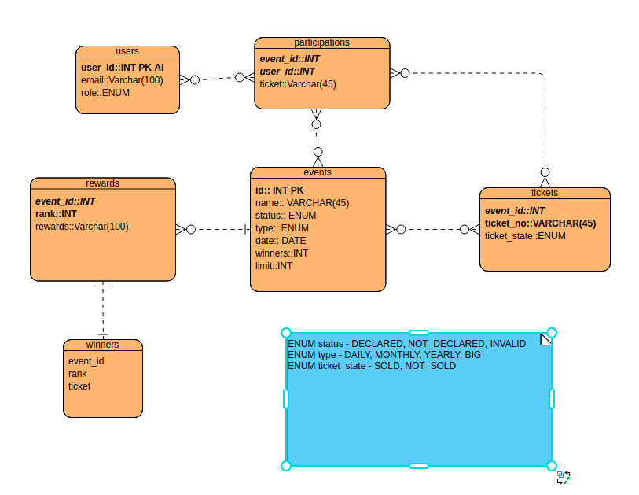

### Name: Sameer Choudhary

### Phone: 8114563560

### Email: sameerme@iitk.ac.in


## How to run

* First create a **.env** file in the root folder with following contents

  ```javascript
  NODE_ENV="development"
  PORT=3001
  DB_URL=127.0.0.1
  DB_PORT=5432
  DB_USER="sameer"
  DB_PASSWORD="sameer@1234"
  DATABASE="grofers"
  CRON_INTERVAL="00 20 * * *"
  ```

  1. Replace DB_URL, DB_PORT, DB_USER, DB_PASSWORD, DATABASE values with your postgres setup

  **Then follow following commands**

  ```bash
  npm install
  npm run migrate
  npm run seed
  npm start
  ```

* Following users are present in DB(**npm run seed** is used to insert this user into users table)

  ```bash
  USER = [
      {
        "email": "sameerme@iitk.ac.in",
        "role": "ADMIN"
      },
      {
        "email": "sameerme1@iitk.ac.in",
        "role": "USER"
      },
      {
        "email": "sameerme2@iitk.ac.in",
        "role": "USER"
      },
      {
        "email": "grofers@iitk.ac.in",
        "role": "USER"
      },
      {
        "email": "grofers1@iitk.ac.in",
        "role": "USER"
      },
      {
        "email": "grofers2@iitk.ac.in",
        "role": "ADMIN"
      }
    ]
  ```


### Following API expose

```bas
1. GET /events/upcoming_event
  Api: return all future events
  Implementation can found in event.route.js file in route directory
  

2. GET /events/upcoming_event?event_type=<value>
	return future events of specific type
	here event_type can takes value in ['DAILY', 'WEEKLY', 'MONTHLY', 'YEARLY', 'BIG']
	
	Implementation can found in event.route.js file in route directory
```


create-event

```bas
1. POST event/create-event
	Allow admin to create an event
	body: {
		event_name: "",
		event_type: ""//['DAILY', 'WEEKLY', 'MONTHLY', 'YEARLY', 'BIG'],
		event_date: ""//annocement of event date,
		event_winners: ""//Total winners in the event
		event_limit: ""//Maximum participants take part in the event,
		prize: [
		{
			rank: 1,
			prize: "Iphone"
		}]
	}
```

Tickets

```bash
GET /raffle-ticket/tickets?event_id=1
	return Default All Sold and unsold
	which we can filter by state parameter
GET /raffle-ticket/tickets?event_id=1&state=NOT_SOLD
	return all unsold tickets for event 1
GET /raffle-ticket/tickets?event_id=1&state=SOLD
	return all sold tickets for event 1
```


Buy-tickets

```bash
POST /raffle-ticket/buy-ticket
	body: {
		email: 'sameerme@iitk.ac.in',
		event_id: '1',
		ticket_no: '0c8'
	}
Allows a user to buy a ticket for an event one time
```


Winners

```
GET /winner
	Return winners of a week
	
GET /winner?by=
	here by takes value in "week", "month", "year", "all"
	return respective winners
	
return by some what look like
{
    "data": [
        {
            "id": 1,
            "name": "grofers at IITK",
            "status": "DECLARED",
            "type": "DAILY",
            "winners": [
                {
                    "rank": 1,
                    "ticket": "0m8",
                    "email": "sameerme1@iitk.ac.in"
                },
                {
                    "rank": 2,
                    "ticket": "1m8",
                    "email": "sameerme2@iitk.ac.in"
                },
                {
                    "rank": 3,
                    "ticket": "U9b",
                    "email": "sameerme@iitk.ac.in"
                }
            ]
        }
    ],
    "offset": 0,
    "page_no": 1,
    "per_page": 10
}
	
```

get_winner_by_id 

```ba
GET /winner/by-event_id?event_id=?
return winners of declared event
Output:
[
    {
        "id": 1,
        "name": "grofers at IITK",
        "status": "DECLARED",
        "type": "DAILY",
        "winners": [
            {
                "rank": 1,
                "ticket": "0m8",
                "email": "sameerme1@iitk.ac.in"
            },
            {
                "rank": 2,
                "ticket": "1m8",
                "email": "sameerme2@iitk.ac.in"
            },
            {
                "rank": 3,
                "ticket": "U9b",
                "email": "sameerme@iitk.ac.in"
            }
        ]
    }
]
```


## Following thing I consider in the assignment

1. Result always declared at fixed time. for example(8:00 pm)
2. An event has fixed number of tickets and winners
3. All user already present in the databases
4. In tickets I'm using Alphanumeric charaset [a-z A-Z 0-9]

## About assignment

1. I used node and express for server
2. Knex for database migration and query building
3. PostresSQL as database
4. Node-cron for cron job
5. async-retry for retry
6. joi for validation
7. With the help of **Randomstring** package generating packages


### How I created raffle tickets for an event

1. Lets us assume L be the limits of an event(i.e. that many ticket will be sells for an event)
2. Therefore minimum characters in a ticket should be **C=** **ceil(log(L)/log(62))** (here 62 be the charaset)
3. Then, I will generate L different tickets of length(**C**) using randomstring package

Above implementation can be found in: ***src/helper/generateticketsforevent.js***


### How I calculated winners of an event

​	***Assuming result always declared at 8:00pm(can be change from environment variable***

1. I created an cron job that run every day at scheduled time
2. Then, It fetch all events whose **event_date(timestamp) <= current date+time** and **status- NOT_DECLARED**
3. Then, for a given event, using event_id, fetching all participants from participations table
4. Then generating desire amount of winners by randomly sorting all participants
5. Then insert winners for the event into winners table and update **event.Status to DECLARED**

 	6. If any of events winners calculation get failed then, It will retry again upto 5 times
 	7. After 5 times, calculation still failing then here we can implement wake up call mechanism(such as email triggers or slack messaging)





